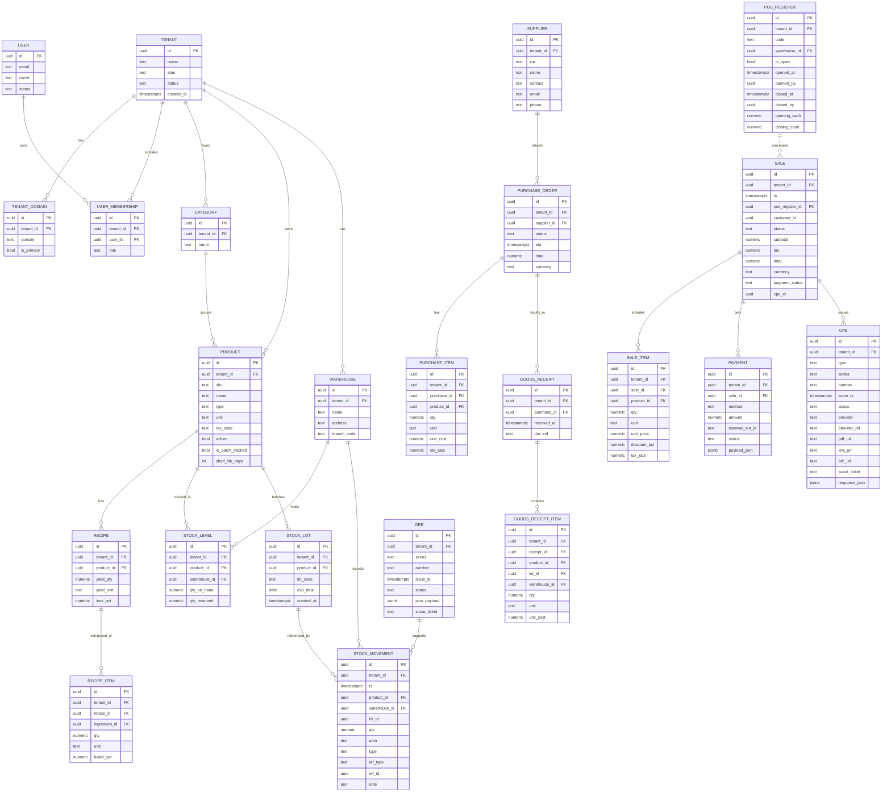

¡Listo! Aquí tienes un **plan de ingeniería de software completo** para tu **SaaS de panaderías** (recetas, producción, inventario con lotes/vida útil y mermas, ventas/POS, CPE/GRE, pagos locales, reportes), incluyendo **requisitos funcionales y no funcionales**, **modelo de dominio y datos**, **estrategia multi-tenant con RLS**, y **todos los diagramas clave en Mermaid** (con guía rápida de uso).

---

# 1) Requisitos funcionales (agrupados por dominio)

## 1.1 Tenancy & usuarios

* Alta/baja/edición de **panaderías (tenants)** con subdominio, plan, branding.
* Gestión de **usuarios** y **roles** por tenant: `OWNER`, `MANAGER`, `CASHIER`, `BAKER`, `STOREKEEPER`.
* Inicio de sesión (OIDC / Supabase Auth) y **scoping por tenant** en cada petición.
* Panel de **admin global** (tuyo) para crear tenants, ver consumo, bloquear/re-activar.

## 1.2 Catálogo y recetas

* CRUD de **productos**: terminados, insumos y empaques; UOM; impuestos; precio(s).
* **Recetas** por porcentaje panadero; rendimiento esperado y merma objetivo.
* **Listas de precios** por canal/sucursal, vigencias y monedas.

## 1.3 Inventario, compras y lotes

* Múltiples **almacenes/sucursales**; inventario por **producto/almacén/lote**.
* **Lotes** con **fecha de caducidad**, trazabilidad y alertas de vencimiento.
* **Órdenes de compra**, recepción (**goods receipt**) con costos y asignación de lotes.
* Ajustes de inventario y **transferencias** entre almacenes (opcional GRE si traslado).

## 1.4 Producción (panificación)

* **Órdenes de producción** por receta (planificada vs real).
* **Consumo de insumos** (descarga de stock) y **producción de terminados** (ingreso a stock/lote).
* Registro de **mermas reales** y rendimiento; recalculo de costo estándar.

## 1.5 Ventas / POS / Pagos

* **POS** con búsqueda rápida, lector código/QR opcional, descuentos, **cierres de caja**.
* Medios de pago: **efectivo, tarjeta, Yape/Plin, transferencia** con **conciliación**.
* Emisión de **CPE** (boleta/factura/notas) vía **SEE** o **PSE (Nubefact)**; descarga de PDF/XML/CDR.
* **GRE** para traslados (tienda–planta, etc.).

## 1.6 Reportes y auditoría

* **Kardex** por producto/almacén/lote; **stock al día**; **ventas por hora/canal**; **mermas**.
* **Cierres de caja** y conciliaciones (pagos externos).
* **Bitácora/Audit log** por usuario/acción/entidad.

## 1.7 Configuraciones

* Impuestos (IGV/tasas/exoneraciones por período), series y numeración CPE/GRE por tenant.
* Integraciones: **pasarelas de pago** (Izipay/Culqi/Niubiz), **PSE**.
* Plantillas de impresión, monedas, formatos de fecha, zona horaria.

---

# 2) Requisitos no funcionales

* **Seguridad & aislamiento**: **RLS** por `tenant_id` en todas las tablas de negocio; JWT con `tenant_id` en claims. (RLS nativa de Postgres; Supabase soporta policies con JWT). ([PostgreSQL][1], [Supabase][2])
* **Cumplimiento local**: soporte **CPE** (SEE/PSE) y **GRE**; parametrización tributaria (IGV, exoneraciones por vigencia) y conservación de comprobantes. ([NubeFact][3], [Gobierno del Perú][4])
* **Disponibilidad**: tolerante a fallos por zona; rollbacks de despliegue; backups automáticos de DB con restauración probada.
* **Rendimiento**: p95 < 300 ms en endpoints críticos (POS, stock); lectura de catálogo < 100 ms con cache.
* **Escalabilidad**: horizontal en servicios stateless; índices por `(tenant_id, ...)`; paginación; límites por plan.
* **Observabilidad**: trazas distribuidas, métricas (RPS/latencia/error rate), logs estructurados, auditoría a nivel dominio.
* **Mantenibilidad**: arquitectura **hexagonal**; contratos API versionados; pruebas multi-capa (unidad/integ/e2e).
* **Usabilidad**: POS “rápido con teclado” y modo degradado si hay microcortes (cola local y reintentos).
* **Internacionalización**: `es-PE`, PEN, decimales latam, formatos de fecha 24h.

---

# 3) Suposiciones y restricciones

* MVP **sin colas/mensajería**: todo síncrono (REST); tareas programadas con `APScheduler` y operaciones idempotentes.
* **DB compartida + RLS** como modelo multi-tenant de arranque (migrable a “schema por tenant” o “DB por tenant” más adelante).
* Hosting: Front **Next.js (Vercel)**; servicios **FastAPI**; **PostgreSQL/Supabase**; almacenamiento S3-compatible.

---

# 4) Roles y permisos (matriz base)

| Recurso/Acción       | OWNER | MANAGER |      CASHIER |        BAKER |  STOREKEEPER |
| -------------------- | ----: | ------: | -----------: | -----------: | -----------: |
| Tenants/Planes       |     ✔ |       – |            – |            – |            – |
| Usuarios/Roles       |     ✔ |       ✔ |            – |            – |            – |
| Catálogo/Precios     |     ✔ |       ✔ |        (ver) |            – |        (ver) |
| Recetas              |     ✔ |       ✔ |            – |            ✔ |            – |
| Inventario (ajustes) |     ✔ |       ✔ |            – |            – |            ✔ |
| Compras/Recepciones  |     ✔ |       ✔ |            – |            – |            ✔ |
| Producción           |     ✔ |       ✔ |            – |            ✔ |            ✔ |
| POS/Ventas           |     ✔ |       ✔ |            ✔ |            – |            – |
| CPE/GRE              |     ✔ |       ✔ | (emitir CPE) |            – | (emitir GRE) |
| Reportes             |     ✔ |       ✔ |     (ventas) | (producción) |      (stock) |

> La autorización se hace **RBAC** + políticas RLS por fila.

---

# 5) Modelo de datos (ERD Mermaid)



---

# 6) Diagramas de arquitectura (Mermaid)

## 6.1 Sistema (contexto, “C4-ish”)


## 6.2 Contenedores (detalle técnico)


---

# 7) Diagramas de **secuencia** (flujos críticos)

## 7.1 Venta POS con pago Yape y CPE


*(Las pasarelas en Perú exponen SDKs + **webhooks**/notificaciones para confirmar pagos). ([developers.izipay.pe][5], [testdevelopers.izipay.pe][6], [docs.culqi.com][7], [niubiz.com.pe][8])*

## 7.2 Orden de producción


## 7.3 Recepción de compra con lotes


---

# 8) Diagramas de **estado**

## 8.1 `production_order`


## 8.2 `pos_register` (caja)


---

# 9) RLS multi-tenant (políticas ejemplo)

* **Idea**: todas las tablas llevan `tenant_id`; cada request establece `SET app.tenant_id` y las políticas **USING/WITH CHECK** hacen cumplir el aislamiento. (RLS nativa de Postgres; `CREATE POLICY` y `ALTER TABLE ... ENABLE ROW LEVEL SECURITY`). ([PostgreSQL][1])

```sql
ALTER TABLE product ENABLE ROW LEVEL SECURITY;

CREATE POLICY product_by_tenant ON product
  USING (tenant_id = current_setting('app.tenant_id')::uuid)
  WITH CHECK (tenant_id = current_setting('app.tenant_id')::uuid);
```

* En **Supabase**, puedes mapear `jwt.claims.tenant_id` en las policies. ([Supabase][2])

---

# 10) API (contratos REST clave)

* `POST /tenants` (admin): crea tenant y dominio; `GET /me`.
* `POST /products`, `GET /products?search=...`, `POST /recipes`, `POST /price-lists`.
* `POST /warehouses`, `POST /stock/adjust`, `POST /purchase-orders`, `POST /goods-receipts`.
* `POST /production-orders`, `POST /stock/consume|produce`.
* `POST /pos/register/open|close`, `POST /sales`, `POST /payments`, `POST /sales/commit`.
* `POST /fiscal/cpe`, `POST /fiscal/gre`.
* `POST /payments/webhook` (firma/verificación según pasarela). *(Izipay/Culqi/Niubiz proveen notificaciones/webhooks/SDKs).* ([developers.izipay.pe][5], [docs.culqi.com][7], [niubiz.com.pe][8])

---

# 11) Calidad, pruebas y observabilidad

* **Pruebas**:

  * Unidad (dominio hexagonal: recetas, reservas, reglas de stock).
  * Integración (repos/DB con RLS activa; prueba de fuga entre tenants debe fallar).
  * E2E (POS → cobro → CPE/GRE). Webhooks simulados.
* **Observabilidad**:

  * Métricas: `http_server_requests_seconds_*`, errores por endpoint/tenant, latencias, colas locales POS.
  * Trazas: `X-Tenant` como atributo; spans por interacción externa (PSE/pagos).
  * Logs JSON con `tenant_id`, `user_id`, `ip`, `action`.

---

# 12) Integraciones locales (referencias breves)

* **CPE/PSE**: **Nubefact** (API REST para enviar JSON/TXT y recibir PDF/XML/CDR). ([NubeFact][3])
* **GRE**: emisión por **SEE-SOL** (RUC + Clave SOL y requisitos). ([Gobierno del Perú][4])
* **Pagos**:

  * **Izipay**: SDK web y **webhooks** de notificación. ([testdevelopers.izipay.pe][6], [developers.izipay.pe][5])
  * **Culqi**: pagos online + **Yape** vía API/Checkout. ([docs.culqi.com][7])
  * **Niubiz**: soluciones e integración con botón **Yape**. ([niubiz.com.pe][9])

---

# 13) Cómo escribir diagramas **Mermaid** (guía rápida)

* Encierra el diagrama en un bloque de código:
  \`\`\`mermaid
  flowchart TD
  A --> B
  \`\`\`
* Tipos usados aquí: **flowchart**, **sequenceDiagram**, **stateDiagram-v2**, **erDiagram**.
* Referencia oficial de sintaxis y ejemplos: **Mermaid docs** (diagramas, estado, etc.). ([mermaid.js.org][10], [docs.mermaidchart.com][11])

---

## 14) Checklist de ingeniería para construir el MVP (sin tiempos)

1. **Tenancy + Auth**: subdominio→`tenant_id`, JWT con `tenant_id`, RLS activo y testeado.
2. **Catálogo & Recetas**: editor de recetas (porcentaje panadero), listas de precio.
3. **Inventario con lotes**: stock\_level + stock\_movement + Kardex.
4. **Producción**: OP → consume/produce → merma → costos.
5. **POS + Pagos**: flujo reserva/commit/release, SDK pago + webhook.
6. **Fiscal**: adapter **PSE (Nubefact)** primero; luego **SEE** si lo piden.
7. **Reportes y cierres**: ventas por hora, mermas, cierres de caja, exportables.
8. **Observabilidad & Auditoría**: métricas/trazas/logs, audit log de dominio.

